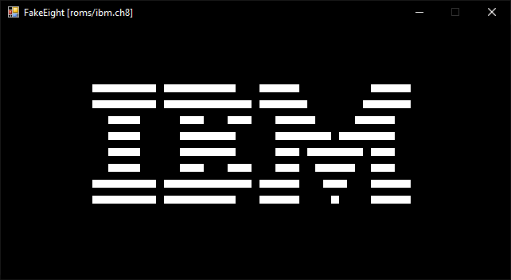

# FakeEight
**Unfinished C# based emulator for CHIP-8**

## State of affairs
- Only a basic subset of CPU opcodes is implemented
- Basically only runs very simple roms
- Hopefully I'll have the time to work on it more at some point in the future
- It was a good learning experience, hope it's useful in some way to someone

## ROMs that work

ROMs that currently run as expected in the emulator:

- `ibm.ch8`: IBM Logo
- `chip9pic.ch8`: Chip-8 Logo
- `chip8em.ch8`: Chip-8 Emulator Logo